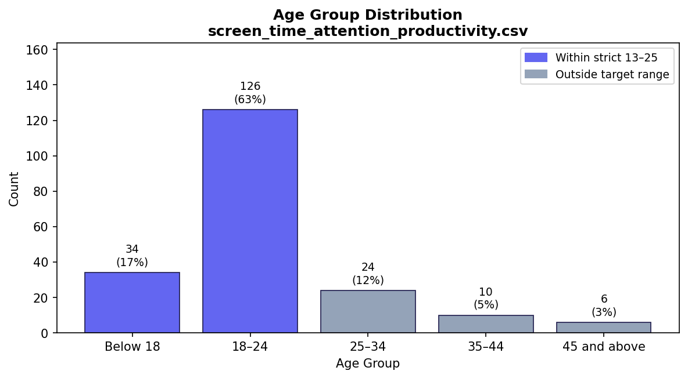
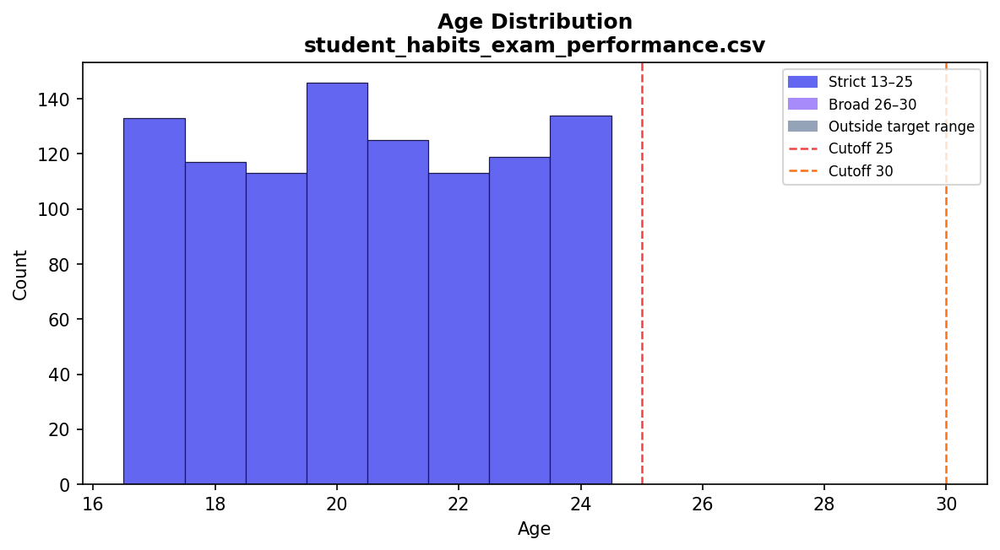
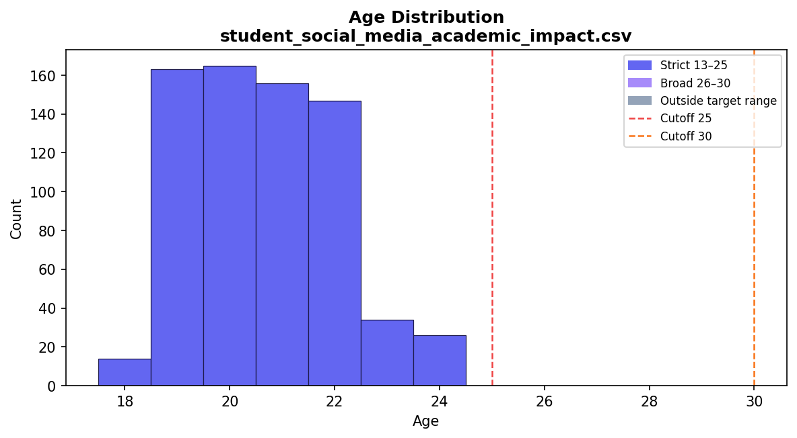
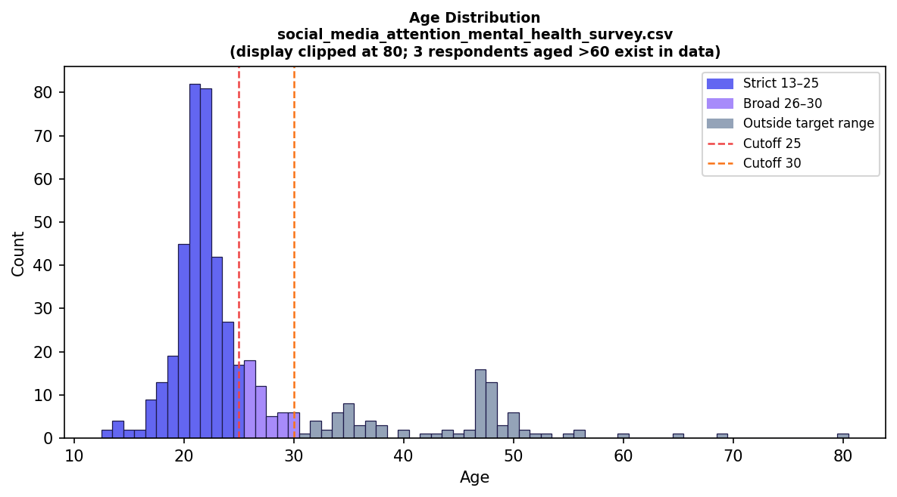

# Population Check — Younger Generation Fit

> **Target definitions:** Strict = ages 13–25 | Broad = ages 13–30

---

## Summary Table

| Dataset | Age Type | Age Range in Data | n Strict 13–25 | n Broad 13–30 | Notes |
|---------|----------|:-----------------:|:--------------:|:-------------:|-------|
| `screen_time_attention_productivity.csv` | Categorical | Below 18 → 45 and above | 160 (80.0%) | ~160 (80.0%) | '25–34' bin unsplittable; ~12 extra rows possible under broad |
| `student_habits_exam_performance.csv` | Numeric | 17–24 | 1000 (100.0%) | 1000 (100.0%) | Tightest age range; entire dataset within target |
| `student_social_media_academic_impact.csv` | Numeric | 18–24 | 705 (100.0%) | 705 (100.0%) | Global student sample; `Academic_Level` available for secondary filter |
| `social_media_attention_mental_health_survey.csv` | Numeric | 13–91 | 345 (71.7%) | 392 (81.5%) | Age-91 outlier present; student-status filter yields 341 (70.9%) |

---

## 1. screen_time_attention_productivity.csv

**Age column:** `Age Group` (categorical ordinal, 5 bins)

### Full Age Distribution

| Age Group | Count | % |
|-----------|------:|--:|
| Below 18 | 34 | 17.0% |
| 18–24 | 126 | 63.0% |
| 25–34 | 24 | 12.0% |
| 35–44 | 10 | 5.0% |
| 45 and above | 6 | 3.0% |

### Population Fit

| Filter | Bins Included | n | % of Total |
|--------|--------------|--:|:---------:|
| Strict 13–25 | 'Below 18' + '18–24' | 160 | 80.0% |
| Broad 13–30  | Same bins ('25–34' unsplittable) | 160 | 80.0% |

> **Caveat:** The '25–34' bin contains 24 respondents spanning ages 25–34. Assuming uniform distribution, approximately 12 fall within 25–30, raising estimated broad coverage to ~86.0%. Exact filtering is not possible without raw age values.

### Other Demographics

**Gender:**
- Male: 132 (66.0%)
- Female: 68 (34.0%)

---

## 2. student_habits_exam_performance.csv

**Age column:** `age` (numeric integer)

### Full Age Distribution

| Statistic | Value |
|-----------|------:|
| Min | 17.0 |
| 25th percentile | 18.75 |
| Median | 20.0 |
| Mean | 20.5 |
| 75th percentile | 23.0 |
| Max | 24.0 |

### Population Fit

| Filter | n | % of Total |
|--------|--:|:---------:|
| Strict 13–25 | 1000 | 100.0% |
| Broad 13–30  | 1000 | 100.0% |
| Excluded (>30) | 0 | 0.0% |

### Other Demographics

**Gender:**
- Female: 481 (48.1%)
- Male: 477 (47.7%)
- Other: 42 (4.2%)

---

## 3. student_social_media_academic_impact.csv

**Age column:** `Age` (numeric integer)

### Full Age Distribution

| Statistic | Value |
|-----------|------:|
| Min | 18.0 |
| 25th percentile | 19.0 |
| Median | 21.0 |
| Mean | 20.66 |
| 75th percentile | 22.0 |
| Max | 24.0 |

### Population Fit

| Filter | n | % of Total |
|--------|--:|:---------:|
| Strict 13–25 | 705 | 100.0% |
| Broad 13–30  | 705 | 100.0% |
| Excluded (>30) | 0 | 0.0% |

### Other Demographics

**Gender:**
- Female: 353 (50.1%)
- Male: 352 (49.9%)

**Academic Level:**
- Undergraduate: 353 (50.1%)
- Graduate: 325 (46.1%)
- High School: 27 (3.8%)

**Top 10 Countries:**
- India: 53 (7.5%)
- USA: 40 (5.7%)
- Canada: 34 (4.8%)
- France: 27 (3.8%)
- Spain: 27 (3.8%)
- Mexico: 27 (3.8%)
- Denmark: 27 (3.8%)
- Switzerland: 27 (3.8%)
- Ireland: 27 (3.8%)
- Turkey: 27 (3.8%)

---

## 4. social_media_attention_mental_health_survey.csv

**Age column:** `Age` (numeric float, collected via Google Form)

### Full Age Distribution

| Statistic | Value |
|-----------|------:|
| Min | 13.0 |
| 25th percentile | 21.0 |
| Median | 22.0 |
| Mean | 26.14 |
| 75th percentile | 26.0 |
| Max | 91.0 |

> **Outlier flag:** Max age = 91 — likely a data entry error. Only 3 respondent(s) aged above 60. Recommend dropping or capping at 60 during the cleaning phase.

### Population Fit

| Filter | n | % of Total |
|--------|--:|:---------:|
| Strict 13–25 | 345 | 71.7% |
| Broad 13–30  | 392 | 81.5% |
| Excluded (>30) | 89 | 18.5% |

### Secondary Filter: Student Status

| Filter | n | % of Total |
|--------|--:|:---------:|
| University Student OR School Student | 341 | 70.9% |
| Other occupations (Salaried Worker, Retired) | 140 | 29.1% |

### Cross-tab: Age Bracket × Occupation

| age_bracket   |   Retired |   Salaried Worker |   School Student |   University Student |   All |
|:--------------|----------:|------------------:|-----------------:|---------------------:|------:|
| <=17          |         0 |                 0 |               19 |                    0 |    19 |
| 18-25         |         1 |                21 |               30 |                  274 |   326 |
| 26-30         |         1 |                30 |                0 |                   16 |    47 |
| 31+           |         6 |                81 |                0 |                    2 |    89 |
| All           |         8 |               132 |               49 |                  292 |   481 |

> **Interpretation:** The strict age filter (13–25) captures 345 rows (71.7%), while the student-status filter captures 341 rows (70.9%). The cross-tab above shows the overlap between age bracket and occupation — the intersection of both filters provides the most conservative target-population subset.

### Other Demographics

**Gender** _(raw — 7 non-binary label variants require normalisation before analysis)_**:**
- Female: 263 (54.7%)
- Male: 211 (43.9%)
- Nonbinary : 1 (0.2%)
- Non-binary: 1 (0.2%)
- NB: 1 (0.2%)
- unsure : 1 (0.2%)
- Trans: 1 (0.2%)
- Non binary : 1 (0.2%)
- There are others???: 1 (0.2%)

**Occupation:**
- University Student: 292 (60.7%)
- Salaried Worker: 132 (27.4%)
- School Student: 49 (10.2%)
- Retired: 8 (1.7%)

---

## Conclusion

**`student_habits_exam_performance.csv`** has the tightest fit to the target population: its age range (17–24) sits entirely within both the strict and broad definitions (100.0% coverage), and it provides a direct continuous `exam_score` outcome variable. **`student_social_media_academic_impact.csv`** is a close second at 100.0% broad coverage, with an explicit `Academic_Level` column enabling secondary filtering by study stage. **`social_media_attention_mental_health_survey.csv`** achieves 81.5% broad coverage but may require additional filtering by `Occupation` (University Student / School Student) to exclude salaried workers and retired respondents who fall within the age range but outside the conceptual younger-generation target; it remains the strongest dataset for direct attention and distraction measures across all four surviving datasets. **`screen_time_attention_productivity.csv`** requires the most caution: categorical age bins prevent precise filtering, and the '25–34' bin straddles both population definitions.