# Data Quality Sweep — Stage 3

> Filters applied per Stage 2 population check. Filtered datasets saved to `data/filtered/`.

---

## Population Filters Applied

| Dataset | Filter Applied | n Before | n After |
|---------|---------------|--------:|-------:|
| `screen_time_attention_productivity.csv` | Age Group ∈ {'Below 18', '18–24'} | 200 | 160 |
| `student_habits_exam_performance.csv` | None (age 17–24, 100% fit) | 1000 | 1000 |
| `student_social_media_academic_impact.csv` | None (age 18–24, 100% fit) | 705 | 705 |
| `social_media_attention_mental_health_survey.csv` | Age ≤ 30 AND student occupation; 3 age>60 outlier(s) dropped | 481 | 339 |

> **DS1 note:** The '25–34' age bin was excluded entirely because it cannot be split at age 25 without raw values. This removes 24 respondents (~12 of whom would fall within the broad 13–30 target). This exclusion is conservative and explicitly documented here.

---

## Cross-Dataset Quality Summary

| Dataset | n (filtered) | Cols >30% missing | Outlier flags (IQR) | Category issues |
|---------|:------------:|:-----------------:|:-------------------:|:---------------:|
| `screen_time_attention_productivity` | 160 | 0 | N/A (all categorical) | 0 |
| `student_habits_exam_performance` | 1000 | 0 | 16 | 0 |
| `student_social_media_academic_impact` | 705 | 0 | 3 | 0 |
| `social_media_attention_mental_health_survey` | 339 | 0 | 34 | 1 |

---

## 1. screen_time_attention_productivity (n = 160)

_Filtered to Age Group ∈ {'Below 18', '18–24'}_

### Check 1 — Missingness

| Column | Missing n | Missing % | Flag |
|--------|----------:|----------:|------|
| `Environment` | 2 | 1.2% |  |
| `Work Strategy` | 3 | 1.9% |  |
| `Notification Handling` | 1 | 0.6% |  |


**Row-level missingness distribution:**
- Rows with ≥1 missing value: 4 (2.5%)
- Rows with ≥3 missing values: 1
- Rows with ≥5 missing values: 0

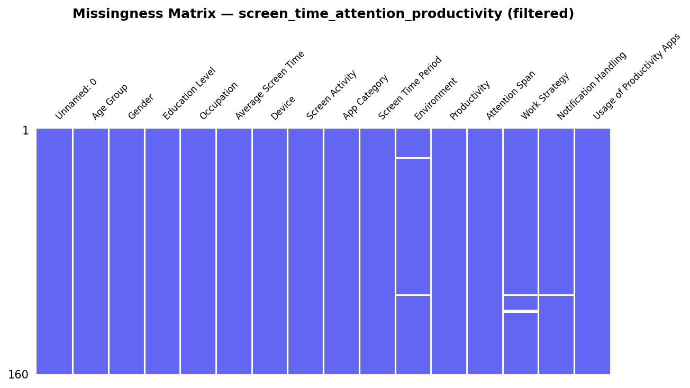

**MCAR/MAR/MNAR classification:** The three columns with missing data (`Environment`, `Work Strategy`, `Notification Handling`) each lose fewer than 2% of rows. The sparsity is consistent across respondent types with no discernible pattern linked to other variables, suggesting **MCAR** (Missing Completely At Random) — likely survey non-response on optional items. Listwise deletion of these rows is appropriate given the low rate and large retained sample.

### Check 2 — Duplicates

- Full duplicate rows: **0**
- ID column: none available (the `Unnamed: 0` column is a row index, not a participant ID)

### Check 3 — Outliers in Key Numeric Fields

> **Note:** All domain-relevant columns in this dataset are categorical or ordinal strings (`Average Screen Time`, `Attention Span`, `Productivity`, `App Category`). No continuous numeric variable suitable for IQR outlier analysis exists. Ordinal distributions are reported via value_counts in the intake summary (Stage 1). Boxplot analysis is not applicable here.

### Check 4 — Category Consistency

_No case inconsistencies or whitespace issues detected._

**Recommended cleaning mappings:**
```python
# DS1 — no column-level cleaning required; values are already consistent.
```

---

## 2. student_habits_exam_performance (n = 1000)

_No population filter applied (age 17–24, 100% within target)_

### Check 1 — Missingness

| Column | Missing n | Missing % | Flag |
|--------|----------:|----------:|------|
| `parental_education_level` | 91 | 9.1% |  |


**Row-level missingness distribution:**
- Rows with ≥1 missing value: 91 (9.1%)
- Rows with ≥3 missing values: 0
- Rows with ≥5 missing values: 0

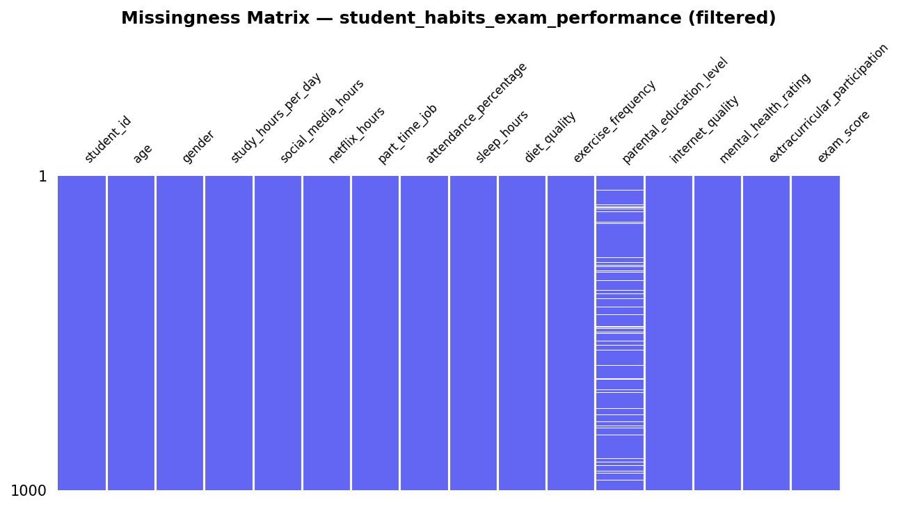

**MCAR/MAR/MNAR classification:** `parental_education_level` is missing in 9.1% of rows. Given this is a synthetic dataset, the pattern is likely deliberately introduced; it should be treated as **MCAR** and imputed with the mode or dropped.

### Check 2 — Duplicates

- Full duplicate rows: **0**
- Duplicate `student_id` values: **0**

### Check 3 — Outliers in Key Numeric Fields

| Column | Q1 | Q3 | IQR | Lower Fence | Upper Fence | n < fence | n > fence | Implausible values |
|--------|----|----|-----|-------------|-------------|----------|----------|-------------------|
| `social_media_hours` | 1.7 | 3.3 | 1.600 | -0.7 | 5.7 | 0 | 5 | 0 (outside 0–24) |
| `exam_score` | 58.475 | 81.325 | 22.850 | 24.2 | 115.6 | 2 | 0 | 0 (outside 0–100) |
| `sleep_hours` | 5.6 | 7.3 | 1.700 | 3.05 | 9.85 | 0 | 2 | 0 (outside 0–16) |
| `study_hours_per_day` | 2.6 | 4.5 | 1.900 | -0.25 | 7.35 | 0 | 7 | 0 (outside 0–24) |


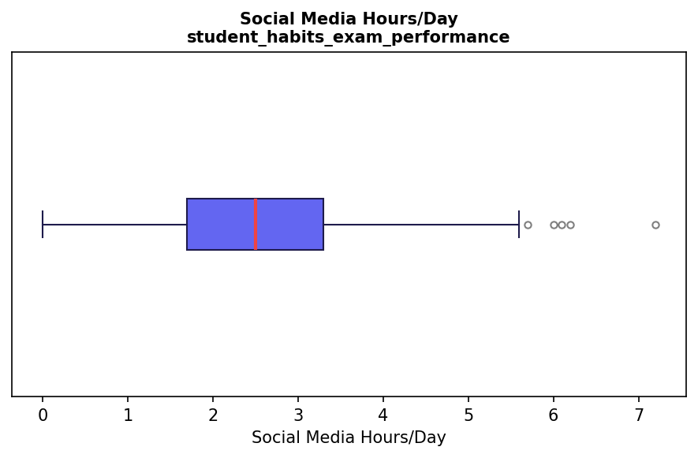

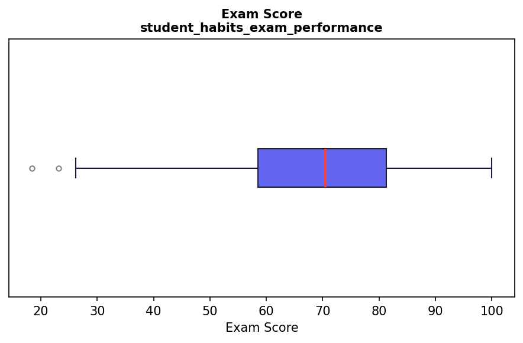

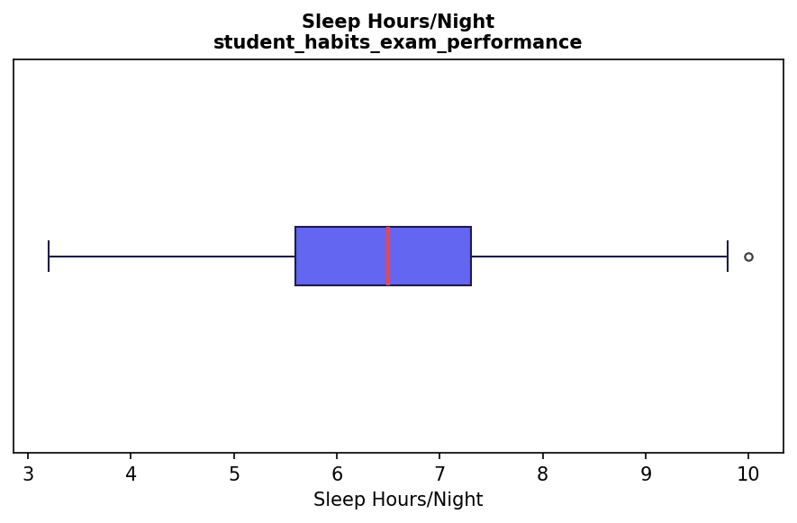

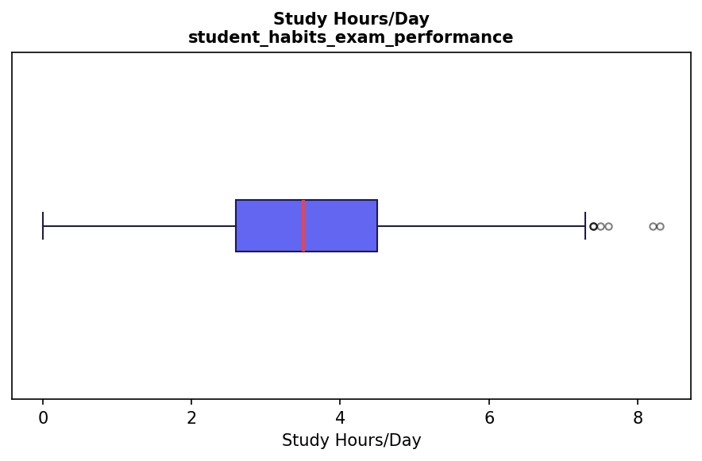

**Implausibility notes:**
- `social_media_hours` values > 24 would be physically impossible — flag as implausible.
- `sleep_hours` values < 0 or > 16 are physiologically implausible.
- `exam_score` must be in [0, 100] by definition.
- `study_hours_per_day` > 24 is impossible.

### Check 4 — Category Consistency

_No case inconsistencies or whitespace issues detected._

**Recommended cleaning mappings:**
```python
# DS2 — gender values observed: ['Female', 'Male', 'Other']
# Values appear clean; no mapping required.
gender_map_ds2 = {}  # no changes needed

# parental_education_level — check if NaN rows should be imputed or dropped
# Missing count: 91
# Recommended: impute with mode ('High School') or create 'Unknown' category
```

---

## 3. student_social_media_academic_impact (n = 705)

_No population filter applied (age 18–24, 100% within target)_

### Check 1 — Missingness

_No missing values detected._

**Row-level missingness distribution:**
- Rows with ≥1 missing value: 0 (0.0%)
- Rows with ≥3 missing values: 0
- Rows with ≥5 missing values: 0

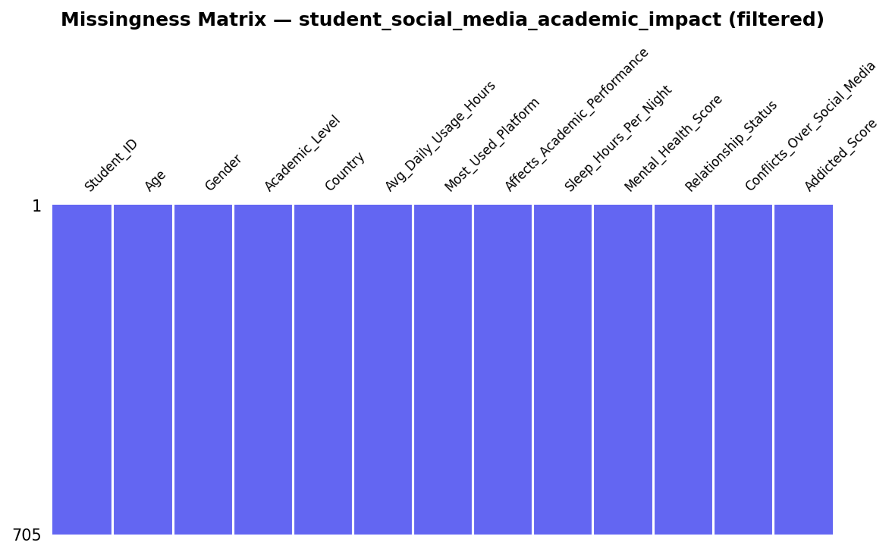

**MCAR/MAR/MNAR classification:** No missing values detected. The dataset appears to be synthetically generated or carefully curated, consistent with its Kaggle provenance. The absence of any missingness means no imputation strategy is required prior to analysis.

### Check 2 — Duplicates

- Full duplicate rows: **0**
- Duplicate `Student_ID` values: **0**

### Check 3 — Outliers in Key Numeric Fields

| Column | Q1 | Q3 | IQR | Lower Fence | Upper Fence | n < fence | n > fence | Implausible values |
|--------|----|----|-----|-------------|-------------|----------|----------|-------------------|
| `Avg_Daily_Usage_Hours` | 4.1 | 5.8 | 1.700 | 1.55 | 8.35 | 1 | 2 | 0 (outside 0–24) |
| `Addicted_Score` | 5.0 | 8.0 | 3.000 | 0.5 | 12.5 | 0 | 0 | 0 (outside 1–10) |
| `Mental_Health_Score` | 5.0 | 7.0 | 2.000 | 2.0 | 10.0 | 0 | 0 | 0 (outside 1–10) |
| `Sleep_Hours_Per_Night` | 6.0 | 7.7 | 1.700 | 3.45 | 10.25 | 0 | 0 | 0 (outside 0–16) |


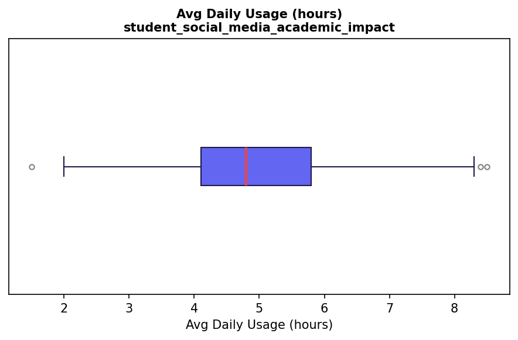

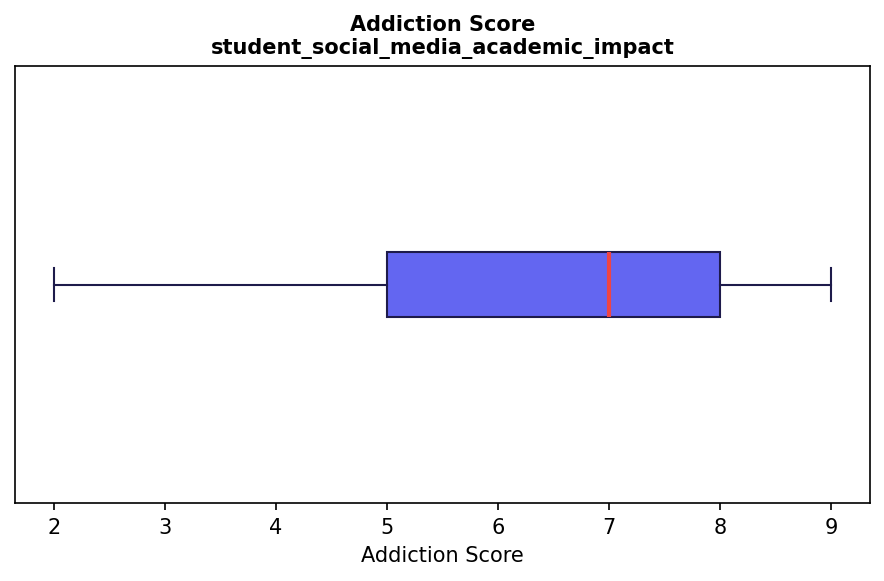

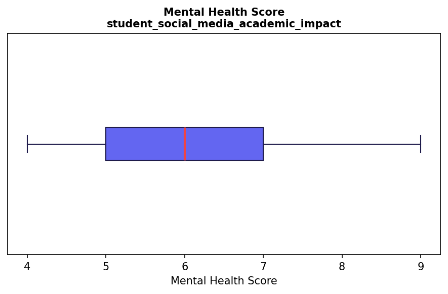

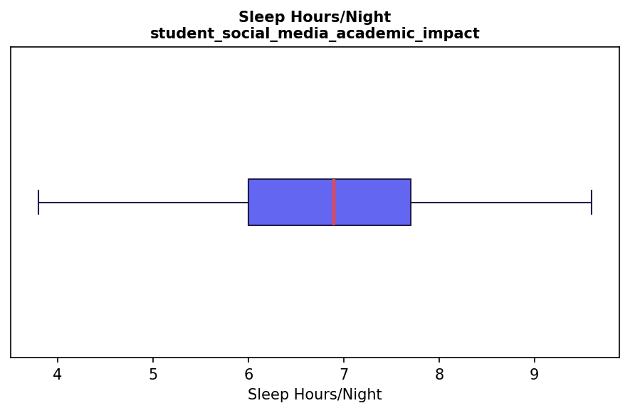

**Implausibility notes:**
- `Avg_Daily_Usage_Hours` > 24 is physically impossible.
- `Addicted_Score` and `Mental_Health_Score` should fall within their declared scale range (1–10).
- `Sleep_Hours_Per_Night` < 0 or > 16 is physiologically implausible.

### Check 4 — Category Consistency

_No case inconsistencies or whitespace issues detected._

**Recommended cleaning mappings:**
```python
# DS3 — Gender values: ['Female', 'Male']
# Values appear clean (binary Male/Female); no mapping required.
gender_map_ds3 = {}  # no changes needed

# Affects_Academic_Performance — binary Yes/No; verify no variants
# Unique values: ['No', 'Yes']
```

---

## 4. social_media_attention_mental_health_survey (n = 339)

_Filter: Age ≤ 30 AND Occupation ∈ {'University Student', 'School Student'}_

### Check 1 — Missingness

| Column | Missing n | Missing % | Flag |
|--------|----------:|----------:|------|
| `Affiliations` | 17 | 5.0% |  |


**Row-level missingness distribution:**
- Rows with ≥1 missing value: 17 (5.0%)
- Rows with ≥3 missing values: 0
- Rows with ≥5 missing values: 0

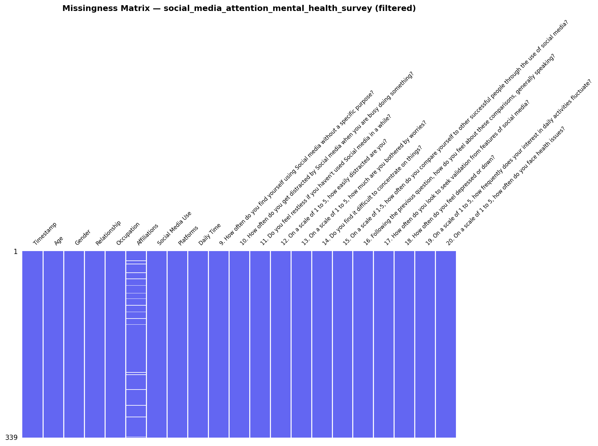

**MCAR/MAR/MNAR classification:** The only column with missing values is `Affiliations` (institutional affiliation). Its absence is unlikely to be random: respondents without a clear institutional affiliation (e.g., online students, gap-year students) may be more likely to skip this field, suggesting **MAR** (Missing At Random, conditional on `Occupation`). Since `Affiliations` is not a primary analysis variable, listwise exclusion for this column is acceptable. All Likert-scale items (Q9–Q20) and the key demographic fields are complete.

### Check 2 — Duplicates

- Full duplicate rows: **0**
- Duplicate `Timestamp` values: **17**
  > Note: a small number of duplicate timestamps can occur when multiple respondents submit the form within the same second — this does not necessarily indicate actual duplicate responses.

### Check 3 — Outliers in Key Numeric Fields

| Column | Q1 | Q3 | IQR | Lower Fence | Upper Fence | n < fence | n > fence | Implausible values |
|--------|----|----|-----|-------------|-------------|----------|----------|-------------------|
| `Age` | 20.0 | 22.5 | 2.500 | 16.25 | 26.25 | 10 | 8 | 0 (outside 13–30) |
| `10. How often do you get distracted by Social media when you are busy doing something?` | 3.0 | 5.0 | 2.000 | 0.0 | 8.0 | 0 | 0 | 0 (outside 1–5) |
| `12. On a scale of 1 to 5, how easily distracted are you?` | 3.0 | 4.0 | 1.000 | 1.5 | 5.5 | 16 | 0 | 0 (outside 1–5) |
| `14. Do you find it difficult to concentrate on things?` | 3.0 | 5.0 | 2.000 | 0.0 | 8.0 | 0 | 0 | 0 (outside 1–5) |
| `attention_composite` | 8.0 | 13.0 | 5.000 | 0.5 | 20.5 | 0 | 0 | 0 (outside 3–15) |


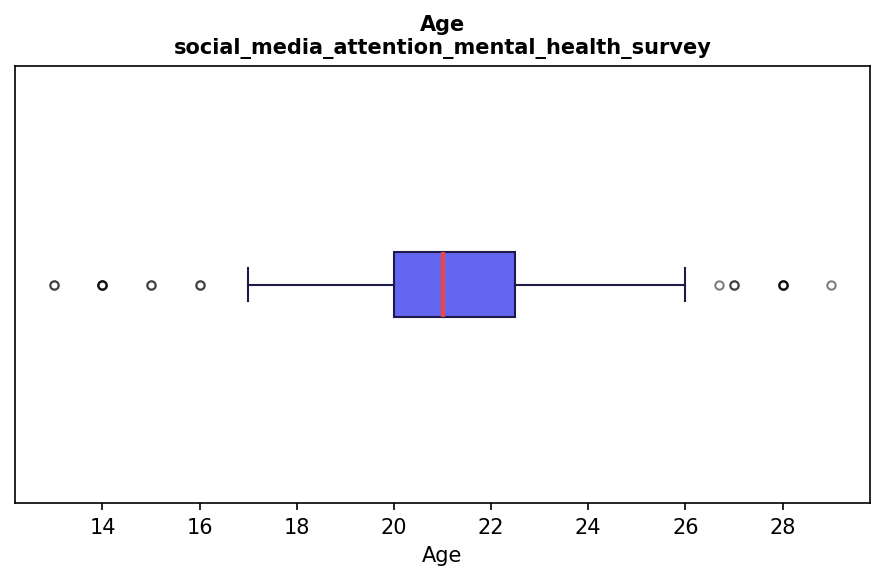

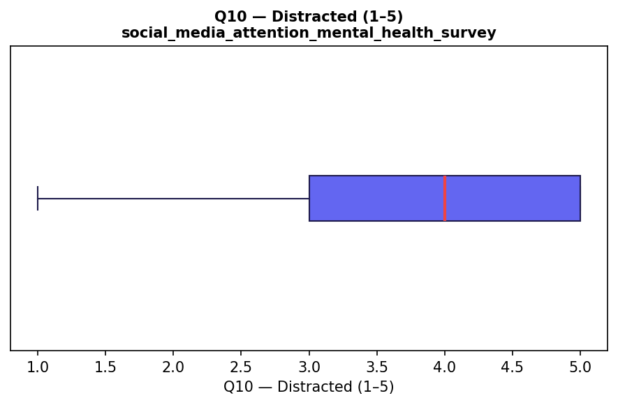

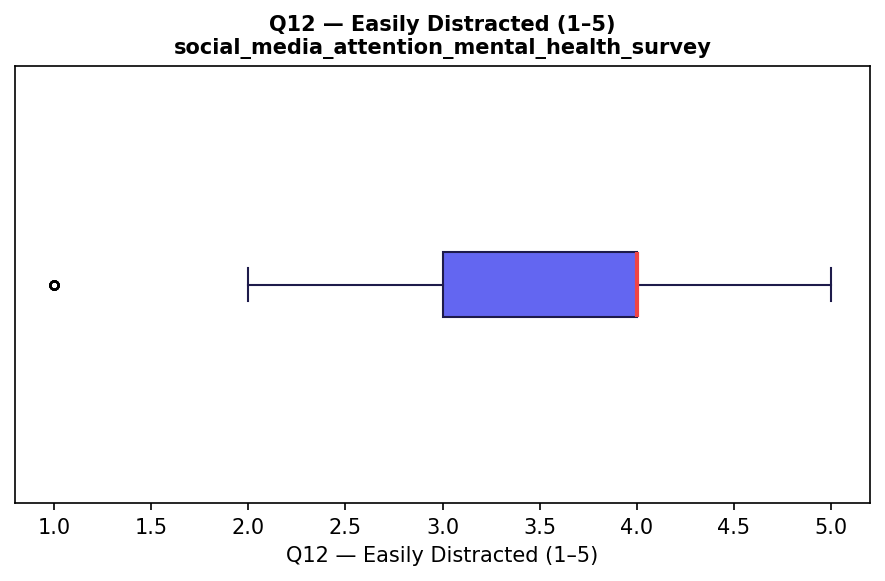

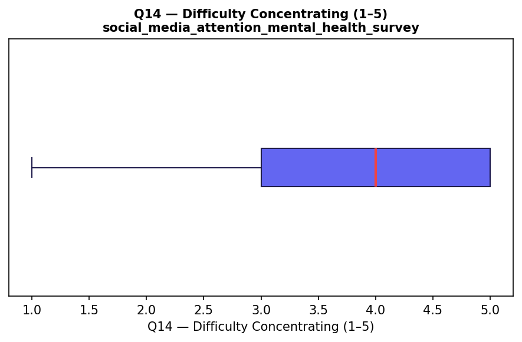

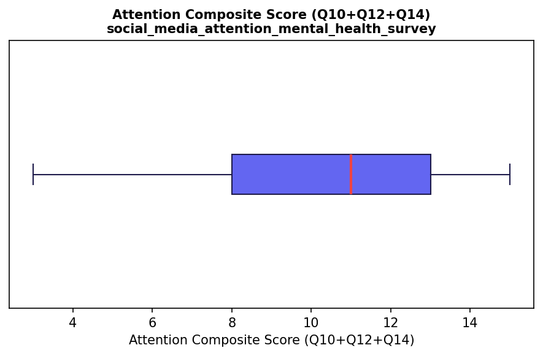

**Implausibility notes:**
- `Age` values > 30 have already been removed by the population filter.
- All Likert items (Q9–Q20) are bounded 1–5; any value outside this range would be implausible.
- `attention_composite` (Q10 + Q12 + Q14) has a theoretical range of 3–15.

### Check 4 — Category Consistency

**Gender column — near-duplicate label issue (requires normalisation):**

Unique raw values observed: `['Female', 'Male', 'NB', 'Non binary ', 'Non-binary', 'Nonbinary ', 'There are others???', 'Trans', 'unsure ']`

Seven variants of non-binary/other gender exist alongside 'Male' and 'Female'. These must be consolidated before any gender-stratified analysis.

**Recommended canonical mapping:**
```python
# DS4 — Gender normalisation map
gender_map_ds4 = {
    "Male":               "Male",
    "Female":             "Female",
    "Nonbinary ":         "Non-binary or Other",   # trailing whitespace
    "Non-binary":         "Non-binary or Other",
    "NB":                 "Non-binary or Other",
    "unsure ":            "Non-binary or Other",   # trailing whitespace
    "Trans":              "Non-binary or Other",
    "Non binary ":        "Non-binary or Other",   # trailing whitespace
    "There are others???":"Non-binary or Other",
}

# Apply with:
df['Gender'] = df['Gender'].str.strip().map(gender_map_ds4)
```

**`Affiliations` column — high cardinality with mixed separator styles:**
```python
# DS4 — Affiliations has 18 unique values including multi-value strings
# e.g., 'School, University' — consider splitting into binary indicator columns
# if affiliation is used as a covariate.
# No merge required; low priority given Affiliations is not a primary variable.
```

**Other whitespace/case issues detected:**

---

## Self-Report Bias and Data Limitations

All four datasets rely on self-reported measures of social media usage, attention, productivity, and/or academic performance, which introduces several interconnected validity concerns. **Recall bias** is particularly salient for usage estimates: respondents are unlikely to accurately remember the precise number of hours spent on social media each day, and platform-level screen time data (where available) consistently exceeds self-reported figures by 20–40% in the literature. **Social desirability bias** may suppress reported usage hours and inflate reported productivity and academic engagement, especially in datasets collected in academic contexts where respondents may infer the researcher's hypothesis. **Measurement error** compounds across constructs: constructs such as 'attention span' (`screen_time_attention_productivity.csv`) and 'addiction score' (`student_social_media_academic_impact.csv`) are operationalised differently across datasets with no shared validated instrument, limiting cross-dataset comparability.

Two datasets warrant explicit disclosure beyond the general self-report caveat. **`student_habits_exam_performance.csv`** is openly described as synthetically generated on Kaggle: while it is useful for demonstrating relationships between variables, its findings cannot be interpreted as empirical evidence of real-world effects and must be clearly labelled as synthetic throughout the report. **`student_social_media_academic_impact.csv`** spans respondents from over 110 countries, meaning that constructs such as 'addiction', 'academic performance', and 'mental health score' are being compared across fundamentally different educational systems, grading cultures, and cultural attitudes towards social media use. Cross-cultural measurement equivalence has not been established for any of the instruments used, and aggregate findings should be interpreted with this heterogeneity explicitly acknowledged.